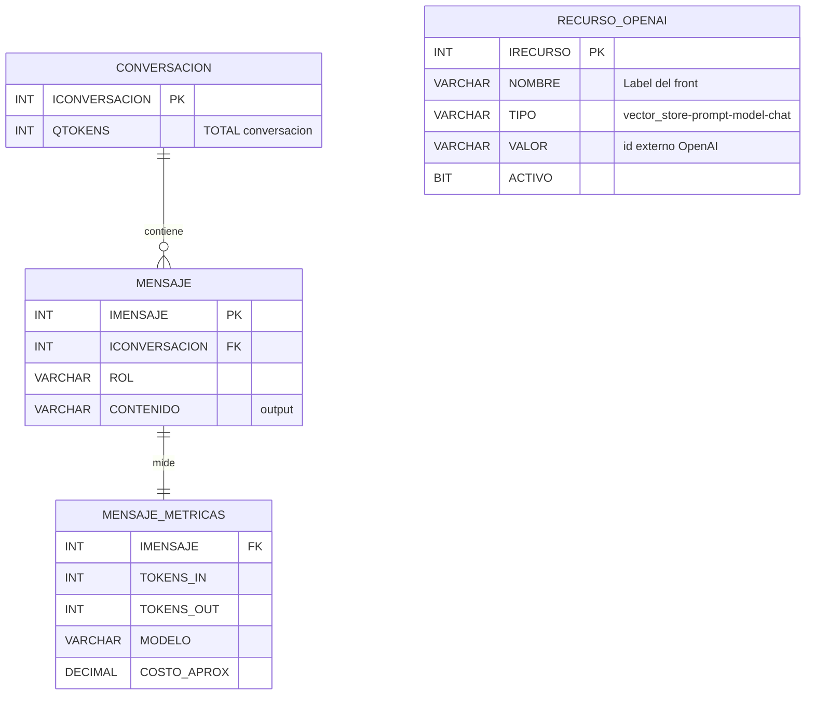

# Diagrama ER — Recursos OpenAI (TK-1429262)

Fuente Mermaid para regenerar la imagen `tk1429262-mermaid-er-recursos.png`.

```mermaid
erDiagram
    CONVERSACION {
        INT ICONVERSACION PK
        INT QTOKENS "TOTAL conversacion"
    }

    MENSAJE {
        INT IMENSAJE PK
        INT ICONVERSACION FK
        VARCHAR ROL
        VARCHAR CONTENIDO "output"
    }

    MENSAJE_METRICAS {
        INT IMENSAJE FK
        INT TOKENS_IN
        INT TOKENS_OUT
        VARCHAR MODELO
        DECIMAL COSTO_APROX
    }

    RECURSO_OPENAI {
        INT IRECURSO PK
        VARCHAR NOMBRE "Label del front"
        VARCHAR TIPO "vector_store-prompt-model-chat"
        VARCHAR VALOR "id externo OpenAI"
        BIT ACTIVO
    }

    CONVERSACION ||--o{ MENSAJE : "contiene"
    MENSAJE ||--|| MENSAJE_METRICAS : "mide"
```
